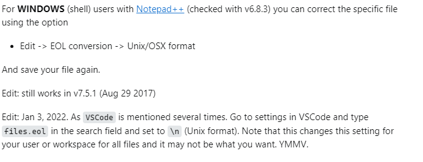

# Astone Back-end

## Overview

The Astone back-end provides RESTful API endpoints for interacting with the backend system, including CRUD operations for managing resources such as users, products, and orders. It utilizes a PostgreSQL database to persist data and implements business logic to process requests and generate responses.

## Docker Setup

To ease setup and deployment, Docker is used to containerize dependencies and provide a consistent environment.

1. **Prerequisites**: Ensure Docker Desktop is installed and running with administrator permissions. [Download Docker Desktop](https://www.docker.com/products/docker-desktop/)

2. **Building and Running**: Navigate to the project directory and run the following commands:
cd /path/to/astone

docker-compose build

docker-compose up

If getting the follwing error after running 'docker-compose up': "not found    | ./start.sh: 2:", it is caused by a file formatiing error.
Refer to the screenshot below on how to resolve this:

3. **Accessing API Endpoints**: API endpoints can be accessed at `http://localhost:8000/`. Combine this base URL with the appropriate suffix based on the URLs defined in `urls.py` to access specific endpoints.

Note that simply navigating to http://localhost:8000/ in your web browser will lead to a 404 page

4. **Admin Interface**: Access the Django admin page at `http://localhost:8000/admin/` to manage entities. Use the following credentials:
- Username: admin
- Password: 1234

## Creating Entities (Models)

1. **Define Models**: Create a new file in `astoneapp.models` for each new model. Define model classes based on your requirements, ensuring to include necessary functions. [Django Models Documentation](https://docs.djangoproject.com/en/5.0/topics/db/models/)

2. **Database Migration**: After defining models, add corresponding tables to the PostgreSQL database by rebuilding the Docker image:
docker-compose up

3. **Verification**: Verify that the database tables are created by checking the Django admin page or using [PostgreSQL desktop application](https://www.postgresql.org/download/).

## Adding Rows to Entities (Models)

1. **Create YAML Files**: In the `astone.db.yaml` directory, create YAML files corresponding to each entity.

2. **Populate YAML Files**: Populate YAML files with sample rows, ensuring they adhere to the constraints and attributes of the defined entities.

3. **Load Data**: Update the `start.sh` script in the main `astone` directory to include commands for loading data from YAML files.

4. **Rebuild Docker Image**: Rebuild the Docker image to apply changes.

5. **Verification**: Check if rows are added using the Django admin page, PostgreSQL desktop app, or corresponding API requests.

## Implementing API Endpoints

1. **Define Views**: Create view functions in `astoneapp.views` grouped by related models. Define view functions using the [`@api_view`](https://www.django-rest-framework.org/api-guide/views/) decorator and handle potential errors with appropriate response status codes.

2. **Serialize Data**: Define serializer classes in `astoneapp.serializers` to serialize response data from view functions.

3. **Map URLs**: Define URL endpoints in `urls.py` in the `astone` directory to map to the corresponding view functions.

4. **Testing**: Test endpoints using tools like [Postman desktop app](https://www.postman.com/downloads/).

## License

Astone is licensed under the [GNU General Public License v3.0](./LICENSE).

