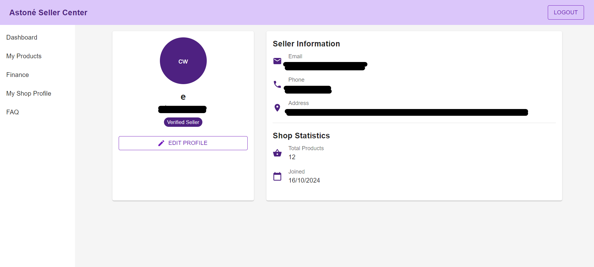
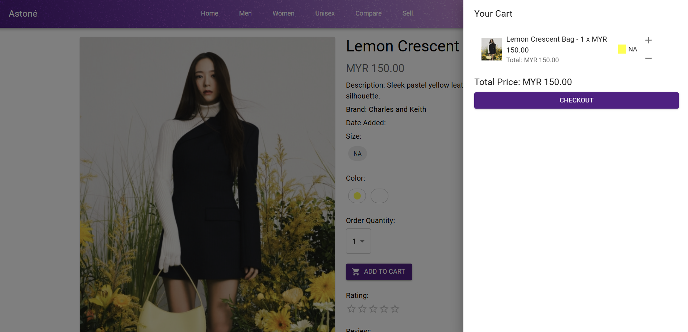
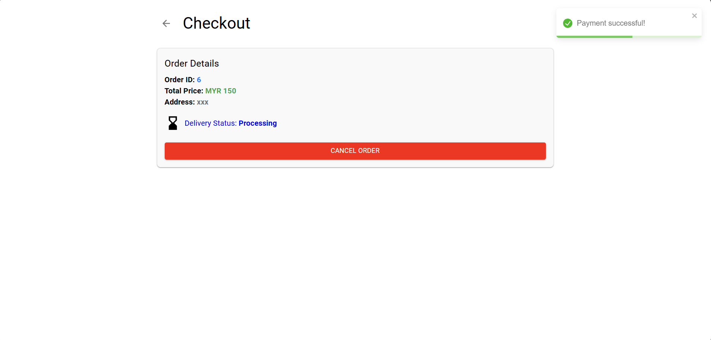

# Astone - Overview 

## Home Page

The home page is the first page that users see when they visit the website. They can select LOGIN button to login the website.

## Login

The login page is where users can enter their email address and password to login the website.

If they do not have account, they must sign up first.

If they have forgotten their passwords, they should click on the "Forgot Password?" to enter their email address to 
reset their passwords.

## Footer and Helpdesk

The users can navigate to "About us", "FAQ", ""Support", "Return Policy", "Privacy Policy" pages on the footer. They
also can hover on the "?" which represents the helpdesk with "Live Chat", "FAQ", "Support".

### About us

About us provides a brief description on the Astone website

### FAQ

Frequently Asked Questions (FAQ) answers the common questions about using Astone

### Support

Support helps with technical issues on account, orders, and payments

### Return Policy

Return Policy provides guidelines for returning products and getting refunds.

### Privacy Policy

Privacy Policy gives an overview of how Astone collects, uses, and protects your data.

### Live Chat

Live Chat provides instant messaging for customer support and inquiries.

## Navigation Bar

The users can navigate to other pages with navigation bar:

<table border=1>
  <tr>
    <th>Label</th>
    <th>Description</th>
  </tr>
  <tr>
    <td>Home</td>
    <td>Return to Home Page</td>
  </tr>
  <tr>
    <td>Men</td>
    <td>Browse all men's products in one place.</td>
  </tr>
  <tr>
    <td>Women</td>
    <td>Browse all women's products in one place.</td>
  </tr>
  <tr>
    <td>Unisex</td>
    <td>Browse all unisex's products in one place.</td>
  </tr>
  <tr>
    <td>Compare</td>
    <td>Select and compare two products' details.</td>
  </tr>
  <tr>
    <td>Sell</td>
    <td>Navigate to the seller view.</td>
  </tr>
  <tr>
    <td>Point</td>
    <td>View the membership's point.</td>
  </tr>
  <tr>
    <td>Cart Icon</td>
    <td>View the products ready to checkout.</td>
  </tr>
</table>

## Seller View

### Signup and Login

Access the seller account, create new seller account, or reset password here.

### Dashboard

Seller can manage order, products, and refund here.

### To-Process Shipment

Seller can click "PROCESS SHIPMENT" if the customer's order is ready to be shipped.

### My Shop Profile

Seller can review their personal information and shop statistics, they can edit their profile.

### Edit Profile

Seller can edit profile by clicking "EDIT PROFILE" in My Shop Profile

### My Product

Seller can review their products' details and create new product here.

### Create new product

Seller can create new product with entering product details and uploading image.

### Product Detail

Seller can edit the information or apply promotion on their products by clicking on the product card.

### Edit Product Detail

Click "EDIT PRODUCT" to edit product details.

### Apply Promotion

Click "APPLY PROMOTION" to enter promotion detail to the product to apply.

### End Promotion

Click "END PROMOTION" if seller wishes to end the promotion.

## Customer View

The customer can view all the products the seller created on home page.

### Men/Women/Unisex

After clicking the categories, customer can filter, sort, and search to view specific products. The below image is the Unisex category:

### Compare

Customer can compare two products by selecting them with dropdown or serach bar, then viewing their information.

### Add to Cart

Customer can add the product to cart by clicking on "ADD TO CART", the product info will be shown and the customer can add the product to cart.

### Checkout
After adding the product to cart, the cart icon on the header will update the number of products in user's cart.

By clicking on the cart icon, the customer can choose product's quantity and proceed to checkout.

During checkout process, customer must enter their information to proceed checkout, they can choose to use membership points for discount. 

During payment, customer can cancel order in a short amount of time before payment is sucessful.

After payment, customer can view their order's details, they can choose to return order.

The point will be updated after payment.

## Settings

User can edit the settings by clicking and navigating on the login account button

In the "ACCOUNT" section, user can edit their personal information except email.

In the "PREFERENCE" section, user can choose to enable notifications.

In the "PRIVACY" section, user can request to delete their accounts.

